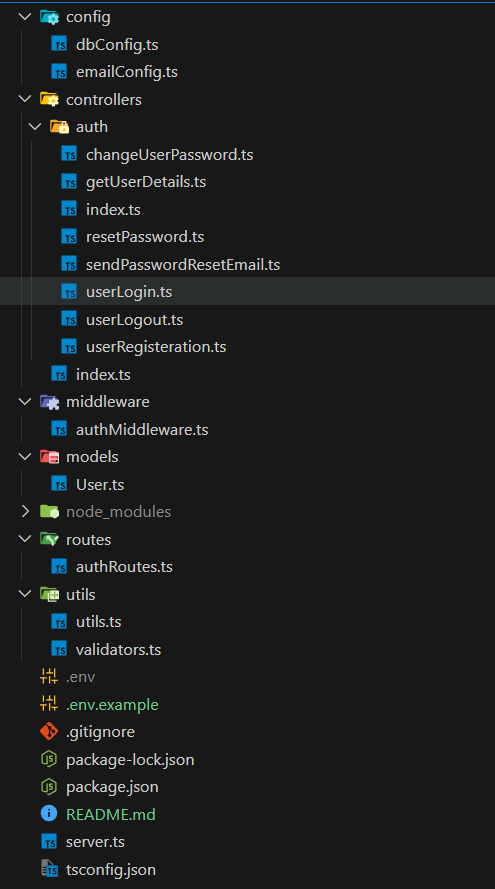
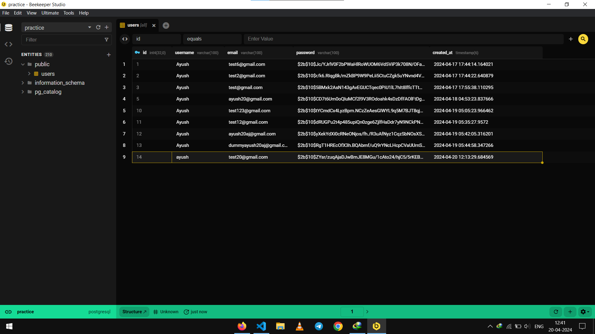
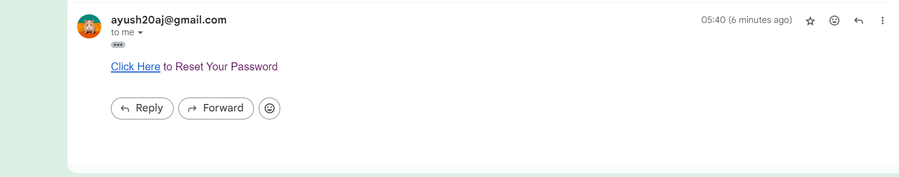

# Authentication using NodeJS + PostgreSQL

This project involves authentication system within a Node.js environment, using Postgres as database, in TypeScript.


## Tools Used

##### `VSCode` : Code Editor
##### `Postman` : Application to develop and test API
##### `PgAdmin` : PostgreSQL administration platform
##### `Beekeeper Studio` : Modern SQL database manager
## Run Locally

To run this project locally, Node and Postgres must be installed in the system.

Clone the project

```bash
  git clone https://github.com/ayushjaiz/postgress-typescript-auth
```

Go to the project directory

```bash
  cd postgress-typescript-auth
```

Install dependencies

```bash
  npm install
```

Start the server

```bash
  npm run start
```


## Environment Variables

Add the following environment variables in .env file as prescribed in .env.example file at project root level


```bash
# app configurations
APP_PORT = 

# database configurations
DB_USER = 'postgres'
DB_HOST = 'localhost'
DB_DATABASE_NAME = 
DB_PASSWORD = 
DB_PORT = 

# jwt secret
JWT_SECRET_KEY = 

# email configuration
EMAIL_ADMIN = 
EMAIL_PASSWORD = 
```
## File Structure



## Routes

### Public Routes

| Route                          | Method | Description                              |
|--------------------------------|--------|------------------------------------------|
| /auth/login                    | POST   | Authenticates user and returns JWT token.|
| /auth/signup                   | POST   | Registers a new user.                    |
| /auth/logout                   | POST   | Logs out the current user.               |
| /auth/send-password-reset-email| POST   | Sends forget password email to user.     |

### Protected Routes

| Route                          | Method | Description                              |
|--------------------------------|--------|------------------------------------------|
| /auth/user-info                | GET    | Retrieves user profile information.      |
| /auth/change-password          | POST   | Updates user password settings.          |

## Screenshots

#### Beekeeper Studio



#### Forget Password Email




## Future Improvements

- Better error handing
- Dockerize the application